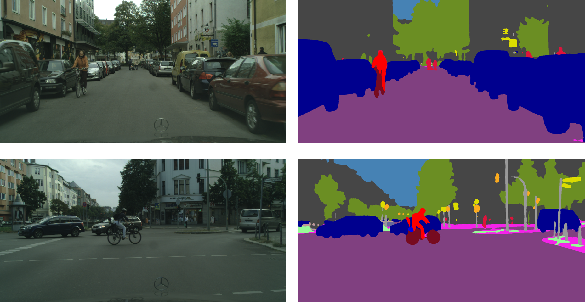
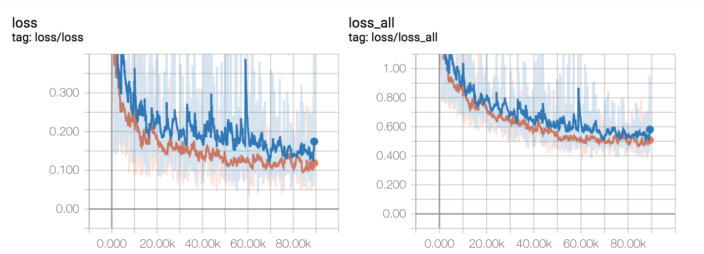
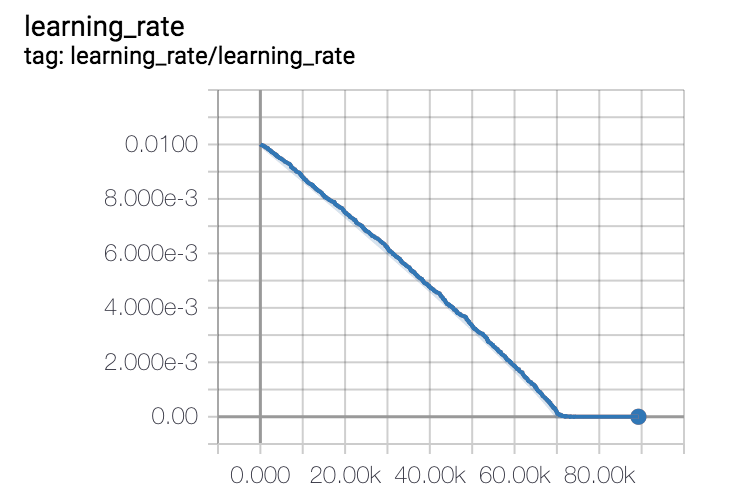

## About

A PSPNet([Pyramid Scene Parsing Network](http://openaccess.thecvf.com/content_cvpr_2017/papers/Zhao_Pyramid_Scene_Parsing_CVPR_2017_paper.pdf)) implementation with Tensorflow.

## Set up

+ Prepare for dataset

    + Download Cityscape from [https://www.cityscapes-dataset.com/downloads/](https://www.cityscapes-dataset.com/downloads/)
    
    + Convert labels to trainIds
    
        reference: [https://github.com/mcordts/cityscapesScripts/blob/master/cityscapesscripts/preparation/createTrainIdLabelImgs.py](https://github.com/mcordts/cityscapesScripts/blob/master/cityscapesscripts/preparation/createTrainIdLabelImgs.py)
        
    + Generate filename list

        + Make Cityscape dataset have the following directory
           ```
            + Cityscape	
               + leftImg8bit
                    + train
                    + val
                    + test
               + gtFine	
                    + train
                    + val
                    + test
            ``` 
        + Config 'CITYSCAPE_DIR' in the cityscape.py
        + python cityscape.py 
        + The directory should be as follows after run 'python cityscape.py':
            ```
            + Cityscape
               + img_test.txt	
               + img_train.txt	
               + img_val.txt
               + anno_test.txt
               + anno_train.txt	
               + anno_val.txt	
               + leftImg8bit
                    + train
                    + val
                    + test
               + gtFine	
                    + train
                    + val
                    + test
            ```
    
+ Download the pretrained model
    + download pretrained resnet101 weight from [http://download.tensorflow.org/models/resnet_v2_101_2017_04_14.tar.gz](http://download.tensorflow.org/models/resnet_v2_101_2017_04_14.tar.gz)
    + download the trained weight from [here](https://pan.baidu.com/s/19emHaT8PMoEcDBJoWGYcFQ) **if you want to inference and evaluate the model**.
    

## Exec

+ Train

    + for **train + val** dataset
    
        > python train.py --dataset trainval --samples 3475
        
    + for **train** dataset
     
        > python train.py

+ Inference [Use your trained model or download checkpoint [here]()]

    + Inference an image in test set randomly
        
        > python predict.py --prediction_on test
        
    + Inference an image in val set randomly
    
        > python predict.py --prediction_on val
    
    + Inference an image in train set randomly
    
        > python predict.py --prediction_on train
    
    + Inference an specified image by file path
    
        > python predict.py --file_path /Volumes/Samsung_T5/datasets/Cityscape/leftImg8bit_trainvaltest/leftImg8bit/test/berlin/berlin_000270_000019_leftImg8bit.png
        
    
+ Evaluation [Use your trained model or download checkpoint [here](https://pan.baidu.com/s/19emHaT8PMoEcDBJoWGYcFQ)]

    + On test set
    
        > python evaluate.py --dataset == 'test'
        
    + On val set
    
        > python evaluate.py --dataset == 'val'
        


## Results

| Desc | Repo(%) | Repo(%) | Paper(%) |
| :---:| :---: | :----: | :----: |
|Train set| train | train+val | train+val |
|mIoU| **73.5** | TBD | 78.4 |

#### Prediction images



## Tensorboard

+ cd **summary** directory and run the following command

    > tensorboard --logdir=./

+ loss


    
+ learning rate



